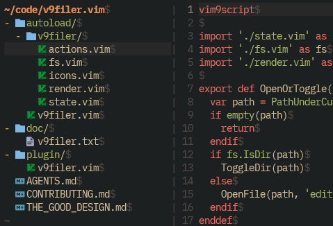

# v9filer.vim

A simple file explorer plugin written in Vim9script.
It shows a directory tree for the current or selected directory, and lets you navigate, expand directories, manage files, and open files in splits without leaving Vim.



## Features

- Lightweight file tree written in Vim9script
- Embedded mode that replaces the current window
- Toggle mode that opens as a left sidebar
- Directory expand/collapse, parent navigation, and root changes
- File creation, rename, delete, and path yank actions
- Hidden file visibility toggle
- Reveal the current file in the sidebar
- Optional Nerd Font icons and colored highlights

## Requirements

- Vim 9.0 or later
- A Nerd Font compatible font if you enable Nerd Font icons

## Installation

Install with your preferred Vim plugin manager.

vim-plug:

```vim
Plug 'musou1500/v9filer.vim'
```

dein.vim:

```vim
call dein#add('musou1500/v9filer.vim')
```

Vim packages:

```sh
git clone https://github.com/musou1500/v9filer.vim.git \
  ~/.vim/pack/plugins/start/v9filer.vim
```

To generate help tags after installation:

```vim
:helptags ALL
```

## Usage

Open in the current window:

```vim
:V9Filer
```

Open as a left sidebar, or close it if it is already open:

```vim
:V9Filer -toggle
```

Open a specific directory:

```vim
:V9Filer ~/src
:V9Filer -toggle ~/src
```

Reveal the current file in the toggle sidebar:

```vim
:V9FilerReveal
```

`:Filer` is an alias for `:V9Filer`.

## Default Mappings

Global mappings:

| Mapping | Action |
| --- | --- |
| `<Leader>ee` | Open the current directory in the toggle sidebar |
| `<Leader>eE` | Open the current directory in embedded mode |
| `<Leader>et` | Open the current file's directory in the toggle sidebar |
| `<Leader>eT` | Open the current file's directory in embedded mode |
| `<Leader>ef` | Reveal the current file in the toggle sidebar |

Main filer buffer mappings:

| Mapping | Action |
| --- | --- |
| `<CR>` | Expand/collapse a directory, or open a file |
| `l` | Change the root to the directory under the cursor |
| `-`, `<BS>` | Go to the parent directory |
| `v` | Open in a vertical split |
| `s` | Open in a horizontal split |
| `D` | Delete |
| `r` | Rename |
| `%` | Create a file or directory |
| `.` | Toggle hidden files |
| `R` | Refresh |
| `C` | Run `:lcd` for the displayed root |
| `y` | Yank the path under the cursor |
| `?` | Toggle quick help |
| `q` | Close the filer |

## Configuration

Example:

```vim
" Hide dotfiles by default
let g:v9filer_show_hidden = false

" Toggle sidebar width
let g:v9filer_width = 40

" Automatically reveal the current file when entering buffers
let g:v9filer_auto_reveal = true

" Disable v9filer highlights
let g:v9filer_use_colors = false

" Enable Nerd Font icons
let g:v9filer_nerd_font_icons = true

" Do not define default global mappings
let g:v9filer_no_default_mappings = true
```

You can add custom Nerd Font icon rules.

```vim
let g:v9filer_nerd_font_icons = true
let g:v9filer_nerd_font_icon_rules = [
      \ {
      \   'text': ' ',
      \   'color': '#6D8086',
      \   'when': {
      \     'name_pattern': '\.conf$',
      \     'is_dir': false,
      \   },
      \ },
      \ ]
```

See the Vim help for full configuration, highlight groups, and behavior details.

```vim
:help v9filer
```

